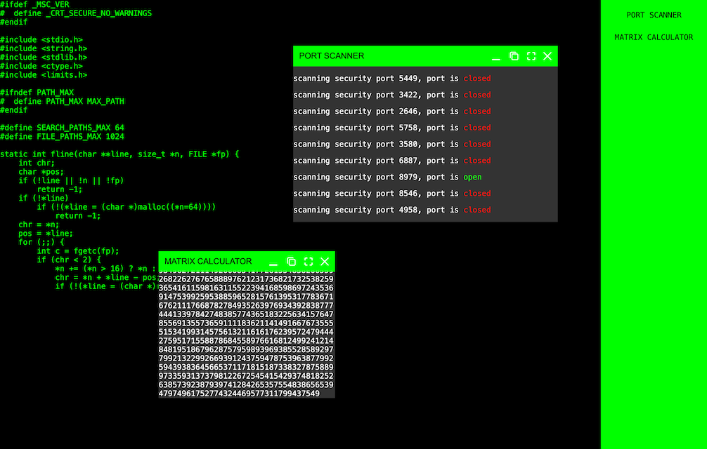

<h1 align="center">HackerDesktop</h1>
<p align="center">Fake hacker web app and code typer, designed for fun</p>

<p align="center">
    <a href="https://github.com/jarne/HackerDesktop/blob/master/package.json">
        
    </a>
    <a href="https://circleci.com/gh/jarne/HackerDesktop">
    
    </a>
    <a href="https://github.com/jarne/HackerDesktop/blob/master/LICENSE">
        
    </a>
</p>

## 📙 Description

HackerDesktop is a fake hacker web app designed for fun, pranks, or cinematic flair. The main screen features a hacker code typer, simulating fast-paced terminal activity. Side windows include a faux port scanner that “scans” IP addresses with realistic-looking feedback, and a random number calculator to generate fake encryption keys or access codes. Perfect for role-play, streaming overlays, or feeling like a pro hacker with zero risk.

### Screenshots



### Architecture

HackerDesktop is a static web app created with plain JavaScript and SCSS. It uses [Winbox](https://github.com/nextapps-de/winbox)
as a dependency for displaying windows inside the application.
Each "hacker app" (window) logic is located in a separate file in the [modules](./assets/js/modules/) folder.

## 🖥 Usage

### Using the hosted version of the app

Use the hosted version at [d2l8gyoh7b3otl.cloudfront.net](https://d2l8gyoh7b3otl.cloudfront.net) (automatic deploys from this repo).

### Build it locally

Firstly, clone the repository and install the dependencies using:

```
$ npm install
```

Then, you can start the development web server with:

```
$ npm start
```

A production build of the web app can be created using:

```
$ npm run build
```

The output files are located in the `dist` folder.

## 🙋‍ Contribution

Contributions are always very welcome! It's completely equal if you're a beginner or a more experienced developer.

Please read our **[Contribution Guidelines](CONTRIBUTING.md)** before creating an issue or submitting a pull request.

Thanks for your interest 🎉👍!

## 👨‍⚖️ License

[MIT](https://github.com/jarne/HackerDesktop/blob/master/LICENSE)
